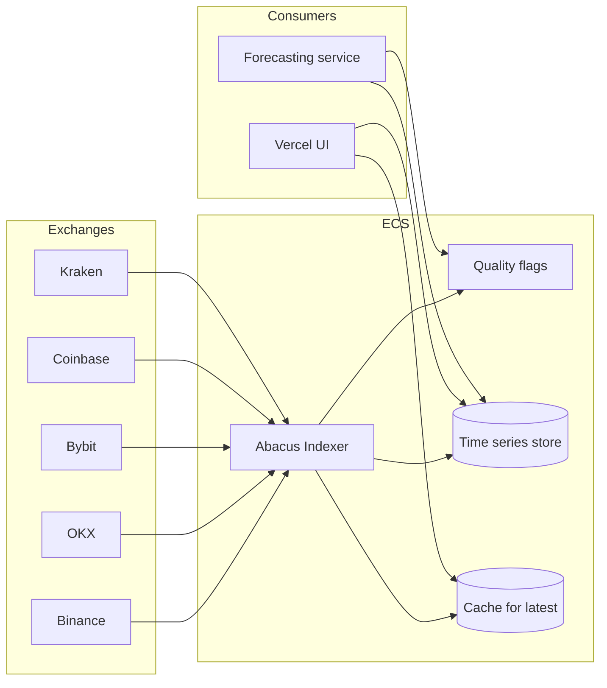

# Exchange Index Composition Analysis

**Document Version:** 1.4
**Date:** December 30, 2025
**Prepared by:** Cipherion Research
**Classification:** Internal - For Stakeholder Review

---

## Executive Summary

This document analyzes the exchange composition used in TradingView's BTC INDEX and evaluates whether it remains appropriate for 2025/26 market conditions. Our findings suggest that while TradingView's methodology prioritizes regulatory credibility and historical continuity, it significantly underweights global volume leaders and may not reflect actual market price discovery dynamics.

**Key Finding:** TradingView's INDEX uses four exchanges representing less than 15% of global spot volume, while excluding Binance (40% market share) and other volume leaders entirely.

**Recommendation:** Implement a tiered index approach that balances institutional compliance requirements with volume representation and price discovery accuracy.

---

## 1. Current TradingView BTC INDEX Methodology

### Formula
```
INDEX = (BITSTAMP:BTCUSD + COINBASE:BTCUSD + BITFINEX:BTCUSD + KRAKEN:BTCUSD) / 4
```

### Characteristics
- **Weighting:** Equal (25% each)
- **Historical Data:** Extends to July 2010 (via Mt. Gox legacy data)
- **Exchange Count:** 4
- **Geographic Bias:** Western markets (EU/US)

### Exchange Profile

| Exchange | Founded | Headquarters | Regulatory Status | Notable Characteristics |
|----------|---------|--------------|-------------------|------------------------|
| Bitstamp | 2011 | Luxembourg | Fully licensed (EU Payment Institution) | World's oldest active exchange |
| Coinbase | 2012 | United States | SEC-regulated, publicly traded (COIN) | U.S. market leader |
| Kraken | 2011 | United States | U.S. regulated, state licenses | Strong EUR pairs, clean security record |
| Bitfinex | 2012 | British Virgin Islands | Unregulated | Historical price discovery influence |

---

## 2. Institutional Benchmark Comparison

### CME CF Bitcoin Reference Rate (BRR)

The CME CF BRR is the industry standard for institutional products, underpinning:
- CME Bitcoin Futures
- U.S. Spot Bitcoin ETFs (IBIT, FBTC, GBTC, etc.)
- Over $500B in regulated futures settlement since 2017

**Constituent Exchanges (2025):**
| Exchange | Included | Notes |
|----------|----------|-------|
| Bitstamp | Yes | |
| Coinbase | Yes | |
| Kraken | Yes | |
| Gemini | Yes | |
| itBit | Yes | |
| LMAX Digital | Yes | Institutional-only venue |
| Bullish | Yes | Added December 2024 |
| Crypto.com | Yes | |
| **Bitfinex** | **No** | Excluded due to regulatory status |

**Key Difference:** CME excludes Bitfinex but includes Gemini, itBit, LMAX Digital, Bullish, and Crypto.com.

### Nasdaq Crypto Index (NCI)

**Core Exchanges:** Coinbase, Bitstamp, Gemini, itBit, Kraken, LMAX Digital

**Selection Criteria:**
- Minimum 2 Core Exchange pricing inputs required
- Assets must be supported by "institutional-ready" infrastructure
- Annual review of constituent exchange compliance

### S&P Cryptocurrency Indices

**Data Provider:** Lukka Prime
**Coverage:** ~20 pre-screened exchanges representing majority of market liquidity
**Methodology:** Volume-weighted with manipulation safeguards

---

## 3. Global Volume Analysis (2025)

### Market Share by Exchange (Q2-Q3 2025)

| Rank | Exchange | Spot Volume Share | 24h Volume (Approx.) | In TV INDEX? |
|------|----------|-------------------|----------------------|--------------|
| 1 | Binance | 38-40% | $17.5B | No |
| 2 | MEXC | ~8% | $3.4B | No |
| 3 | Gate | ~7% | $3.0B | No |
| 4 | Bitget | ~6% | $2.6B | No |
| 5 | Bybit | ~6% | $2.5B | No |
| 6 | Upbit | ~5% | $2.1B | No |
| 7 | OKX | ~5% | $2.0B | No |
| 8 | HTX | ~4% | $1.7B | No |
| 9 | Coinbase | ~5.8% | $2.4B | **Yes** |
| 10 | Crypto.com | ~3% | $1.3B | No |
| — | Kraken | ~3.6% | $1.5B | **Yes** |
| — | Bitstamp | <2% | <$800M | **Yes** |
| — | Bitfinex | <2% | <$800M | **Yes** |

**Analysis:** TradingView's INDEX represents approximately **12-15% of global spot volume** while excluding exchanges comprising **70%+ of market activity**.

### Regional Volume Distribution

| Region | Primary Exchanges | % Global Volume |
|--------|-------------------|-----------------|
| Asia-Pacific | Binance, OKX, Bybit, Upbit, HTX | ~65% |
| North America | Coinbase, Kraken | ~15% |
| Europe | Bitstamp, Kraken (EUR) | ~10% |
| Other | Various | ~10% |

---

## 4. Price Discovery Analysis

### Academic Research Findings

Recent peer-reviewed research on Bitcoin price discovery reveals:

1. **Derivatives Lead Spot:** Perpetual swaps and futures on exchanges like OKX, Bybit, and Binance are the strongest instruments for price discovery. Regulated spot exchanges (including CME futures) tend to *react to* rather than *lead* price movements.

2. **ETF Dominance:** As of 2025, Bitcoin ETFs (particularly IBIT, FBTC, GBTC) dominate price discovery over spot markets approximately 85% of the time.

3. **Liquidity Leadership:** Among spot exchanges, Coinbase demonstrates the strongest bid-ask liquidity at top-of-book, followed by Bitstamp and Kraken. However, raw liquidity does not equate to price discovery leadership.

### Implications

- An index optimized for *price accuracy* should consider derivatives market data
- An index optimized for *institutional compliance* should exclude unregulated venues
- These objectives may be mutually exclusive

---

## 5. Exchange Selection Criteria Framework

### Institutional-Grade Requirements (CME/Nasdaq Standard)

| Criterion | Description | Purpose |
|-----------|-------------|---------|
| Regulatory Licensing | Exchange holds relevant financial licenses | Legal compliance, investor protection |
| Geographic Jurisdiction | Not domiciled in capital-controlled countries | Prevents artificial premiums/discounts |
| Audit Requirements | External audits (e.g., Ernst & Young) | Financial transparency |
| No Extraordinary Legal Action | Not subject to major regulatory enforcement | Operational stability |
| Market Surveillance | Active monitoring for manipulation | Price integrity |
| Custody Standards | Meets institutional custody requirements | Asset security |

### Volume-Based Requirements

| Criterion | Description | Purpose |
|-----------|-------------|---------|
| Minimum Daily Volume | Threshold for inclusion (e.g., $100M/day) | Ensures liquidity |
| Volume Authenticity | Passes wash-trading detection | Prevents artificial inflation |
| Order Book Depth | Minimum bid-ask depth at various levels | Execution quality |
| Uptime Requirements | 99.9%+ availability | Reliability |

---

## 6. Proposed Index Methodologies

### Option A: Institutional Reference Index (Compliance-First)

**Use Case:** Regulatory reporting, institutional products, audit trails

**Constituent Exchanges:**
- Coinbase (U.S.)
- Kraken (U.S.)
- Bitstamp (EU)
- Gemini (U.S.)
- LMAX Digital (UK)
- Crypto.com (U.S. licensed)

**Weighting:** Volume-weighted with caps (max 30% per exchange)

**Pros:**
- Aligns with CME/Nasdaq standards
- All exchanges fully regulated
- Clean audit trail

**Cons:**
- Represents <20% of global volume
- May lag actual market prices
- Western market bias

---

### Option B: Global Volume-Weighted Index (Market-Representative)

**Use Case:** Accurate market pricing, trading signals, arbitrage detection

**Constituent Exchanges:**
- Binance (40% cap)
- Coinbase (15%)
- OKX (10%)
- Bybit (10%)
- Kraken (10%)
- Others (15%)

**Weighting:** Rolling 30-day volume with manipulation filters

**Pros:**
- Reflects actual market activity
- Global coverage
- Better price accuracy

**Cons:**
- Includes unregulated venues
- Potential wash-trading exposure
- May not be acceptable for institutional use

---

### Option C: Hybrid Tiered Index (Recommended)

**Use Case:** Flexible deployment across compliance and trading applications

#### Tier 1: Institutional Core
```
INST_INDEX = (COINBASE × 0.30) + (KRAKEN × 0.25) + (BITSTAMP × 0.20) + (GEMINI × 0.15) + (LMAX × 0.10)
```

#### Tier 2: Global Spot
```
GLOBAL_INDEX = (BINANCE × 0.35) + (COINBASE × 0.15) + (OKX × 0.12) + (BYBIT × 0.12) + (KRAKEN × 0.10) + (UPBIT × 0.08) + (OTHERS × 0.08)
```

#### Tier 3: Price Discovery (Including Derivatives)
```
DISCOVERY_INDEX = (SPOT_COMPOSITE × 0.40) + (BINANCE_PERP × 0.25) + (OKX_PERP × 0.20) + (BYBIT_PERP × 0.15)
```

**Implementation:**
- Use Tier 1 for compliance-sensitive applications
- Use Tier 2 for general market reference
- Use Tier 3 for predictive modeling and signal generation

---

## 7. Risk Considerations

### Regulatory Risk

| Exchange | Jurisdiction | Risk Level | Notes |
|----------|--------------|------------|-------|
| Coinbase | U.S. (SEC) | Low | Publicly traded, full compliance |
| Kraken | U.S. | Low | Strong regulatory track record |
| Bitstamp | EU (Luxembourg) | Low | First licensed EU exchange |
| Gemini | U.S. (NYDFS) | Low | Winklevoss-founded, conservative approach |
| Binance | Multiple | **High** | Ongoing regulatory challenges globally |
| OKX | Seychelles | Medium | Limited U.S. access |
| Bybit | Dubai/BVI | Medium | Derivatives-focused |

### Operational Risk

- **Exchange Failure:** Diversification across 5+ exchanges recommended
- **Data Feed Latency:** Sub-second synchronization required for accurate composite
- **API Reliability:** Redundant connections to each exchange

### Market Manipulation Risk

- **Wash Trading:** Apply volume authenticity filters
- **Spoofing:** Use time-weighted or median pricing
- **Flash Crashes:** Implement circuit breakers and outlier detection

---

## 8. Implementation Recommendations

### Immediate Actions

1. **Audit Current Data Sources:** Verify API connectivity and data quality for all candidate exchanges
2. **Establish Baseline:** Calculate parallel indices using current (TradingView) and proposed methodologies
3. **Deviation Analysis:** Measure historical price deviation between methodologies

### Short-Term (30-60 Days)

4. **Stakeholder Alignment:** Determine primary use case (compliance vs. accuracy)
5. **Exchange Onboarding:** Establish API connections to additional exchanges (Gemini, OKX, Bybit as needed)
6. **Testing:** Run shadow indices in production environment

### Medium-Term (60-90 Days)

7. **Methodology Selection:** Finalize index composition based on testing results
8. **Documentation:** Publish internal methodology document
9. **Deployment:** Transition to new index calculation

---

## 9. Conclusion

TradingView's BTC INDEX methodology, while historically significant and regulatory-friendly, does not reflect 2025 market realities:

- **Volume Gap:** Excludes 85%+ of global trading volume
- **Geographic Bias:** Over-represents Western markets
- **Price Discovery:** Lags actual market due to exclusion of derivatives and Asian exchanges
- **Bitfinex Inclusion:** Inconsistent with institutional standards (CME excludes it)

We recommend adopting a **tiered index approach** that provides:
- Institutional-grade reference pricing for compliance
- Volume-weighted global pricing for accuracy
- Derivatives-inclusive pricing for predictive applications

The specific weighting and constituent selection should be finalized based on stakeholder requirements and intended use cases.

---

## Appendix A: Data Sources

| Source | URL | Data Type |
|--------|-----|-----------|
| TradingView | https://www.tradingview.com/support/solutions/43000659124 | INDEX methodology |
| CME Group | https://www.cmegroup.com/markets/cryptocurrencies/cme-cf-cryptocurrency-benchmarks.html | BRR methodology |
| CF Benchmarks | https://www.cfbenchmarks.com/ | Constituent criteria |
| Nasdaq | https://www.nasdaq.com/solutions/crypto-index | NCI methodology |
| CoinGecko | https://www.coingecko.com/en/exchanges | Volume rankings |
| CoinGecko Research | https://www.coingecko.com/research/publications/centralized-crypto-exchanges-market-share | Market share data |
| ScienceDirect | https://www.sciencedirect.com/science/article/abs/pii/S1572308920300759 | Price discovery research |

## Appendix B: Exchange API Documentation

| Exchange | API Docs | WebSocket | REST |
|----------|----------|-----------|------|
| Coinbase | docs.cloud.coinbase.com | Yes | Yes |
| Kraken | docs.kraken.com | Yes | Yes |
| Bitstamp | www.bitstamp.net/api | Yes | Yes |
| Binance | binance-docs.github.io | Yes | Yes |
| OKX | www.okx.com/docs | Yes | Yes |
| Bybit | bybit-exchange.github.io | Yes | Yes |
| Gemini | docs.gemini.com | Yes | Yes |

## Appendix C: CCXT Exchange Support

The CCXT library (used in this project) supports 108 exchanges, including all candidates discussed in this analysis. This provides implementation flexibility regardless of final exchange selection.

Reference: https://github.com/ccxt/ccxt/wiki/Exchange-Markets

---

*Document prepared for internal stakeholder review. External distribution requires approval.*

---

## Addendum (v1.1) — Abacus:INDEX Decisions + POC Architecture (Dec 30, 2025)

This addendum captures decisions and next steps that came out of stakeholder review, with an emphasis on **predictive accuracy for trading signals** using **1m OHLCV + granular trades**.

### A1. Updated Objective (clarified)

The goal is not to reproduce TradingView’s compliance-oriented BTC index. The goal is to define an **Abacus:INDEX data standard** that reduces label noise and improves signal quality for short-horizon forecasting (2h/12h/24h) by:

1. Creating a **Spot Composite** price stream from market-moving spot venues
2. Creating a **Perp Composite** price stream from market-moving perpetual venues
3. Producing **cross-market features** (basis, funding, lead/lag) that often carry predictive value

This reframing is motivated by microstructure reality: perps frequently lead spot intraday, and collapsing them into one “official” price can destroy signal (basis/funding regimes themselves are information).

### A2. Decision: Perps are NOT blended into spot (separate series + derived features)

For forecasting, Abacus:INDEX will **not** blend perp prices into the spot composite.

Instead:

- `SPOT_INDEX(t)` is computed from spot venues only
- `PERP_INDEX(t)` is computed from perpetual venues only
- Derived features include, at minimum:
  - `basis(t) = PERP_INDEX(t) - SPOT_INDEX(t)`
  - `basis_bps(t) = 10_000 * basis(t) / SPOT_INDEX(t)`
  - lead/lag short-window return features (and later: funding)

Rationale: a “single unified price” requires a fair-value model and robust handling of basis/funding/market segmentation. That complexity is not needed for v1 and would likely reduce interpretability.

### A3. Deployment constraint (important)

- This repository is primarily **UI/visualization** (Vercel deployment).
- The forecasting/model service runs elsewhere on **ECS**.

Implication:
Multi-venue WebSocket fan-in is best handled by an always-on ECS service in production. However, we will validate feasibility/reliability via an in-repo POC first.

### A4. Where Abacus:INDEX should be computed (production)

**Production recommendation:** compute Abacus composites + features in an always-on ECS service (either inside the existing model service or as a sibling “indexer” service), and expose a stable API contract consumable by:

- the forecasting/model service
- this UI (Vercel)

### A5. POC plan (this repo)

We will prove the architecture here using **direct exchange WebSocket connectors** (similar to existing hooks), explicitly as a POC.

Why direct WS for the POC:

- Existing code already implements per-exchange WS hooks and a Binance hybrid stream pattern (kline + trades) for real-time updates.
- CCXT Pro is a better fit for the **ECS production service**, but is not the fastest path for a browser-first validation POC.

#### A5.1 POC limitations (explicit)

This in-repo POC is intended to prove viability and surface integration risks. It is **not** a production-reliability claim due to browser/runtime constraints:

- **Tab backgrounding / throttling:** inactive tabs can throttle timers and network activity.
- **Memory/CPU pressure:** high-frequency trade streams can overwhelm the browser if not aggressively windowed.
- **No persistent state:** refresh/navigation drops in-progress bars and resets telemetry.
- **Connection variability:** local network latency can bias observed lead/lag in the POC.

Action: add a dedicated “POC Limitations” section to the UI debug harness and to the handoff brief so stakeholders interpret reliability results correctly.

### A6. v1 Scope (approved)

**Assets**

- BTC (required)
- ETH (conditional: add only after BTC POC-1 is stable)
- ZEC (deferred to v2+; perp venue coverage is immature and inconsistent across market movers)

**Quotes**

- USD + USDT, with normalization policy (see A8)

### A7. v1 Venue Universe (approved for POC)

#### Spot Composite (USD + USDT)

- Binance spot
- Coinbase spot
- Kraken spot
- OKX spot

#### Perp Composite (USDT linear perps)

- Binance perps
- OKX perps
- Bybit perps

#### Conditional Adds

Add **Crypto.com** only if:

- a primary remember: venue drops frequently / poor uptime
- ZEC coverage requires it

Gemini is not required for the POC (it is a regulated USD venue, but not a primary “market-moving” venue relative to Binance/OKX/Bybit for this objective). It can be revisited if USD anchoring becomes a priority.

### A8. Quote normalization policy (USD vs USDT)

We will support USD and USDT inputs, but the policy must be explicit.

v1 recommended default:

- Treat USDT≈USD 1:1 under normal conditions
- Add a depeg guardrail:
  - detect large persistent dislocations between USD venues (Coinbase/Kraken) and USDT venues (Binance/OKX/Bybit)
  - during depeg-like regimes, downweight or temporarily exclude USDT venues from the spot composite (or apply a stablecoin conversion factor)

### A9. Composite methodology (v1 recommendation)

Avoid pure reported-volume weighting for v1 due to wash/incentive volume risk and inconsistent reporting.

Suggested v1 composite method:

- Build **per-venue 1m bars** from trades (preferred) or venue klines where trustworthy.
- For each minute:
  - Use a robust statistic such as **median** or **trimmed mean** of venue closes
  - Apply outlier rejection / sanity constraints (see A9.1)
- Only later consider weights driven by measured liquidity (spread/depth) rather than self-reported volume.

#### A9.1 Outlier policy (explicit)

The composite must define an outlier threshold appropriate to major crypto pairs.

Recommended v1 default:

- Compute the per-minute **median** `m` of candidate venue closes.
- Exclude a venue from that minute if `abs(px - m) / m > 0.0100` (100 bps / 1.0%).
- Log every exclusion event (venue, symbol, minute, deviation).

Notes:

- 100 bps is intentionally conservative for BTC/ETH (normal cross-venue spreads are typically far tighter), and is primarily a stale/bad-feed guardrail.
- During detected stablecoin depeg-like regimes (A8), temporarily widening the threshold or applying quote normalization may be required.

### A10. Data quality + reliability measurement (POC acceptance criteria)

POC should instrument and report (per venue, per symbol):

- WebSocket uptime / reconnect counts
- message rate (trades/sec, updates/sec)
- missing 1m bars / gaps
- stale feed detection counts
- outlier events and filtered points
- symbol availability coverage matrix (BTC/ETH/ZEC) across venues

### A11. Engineering note: existing code already follows the right pattern

- Binance streaming implementation combines a kline stream with a real-time trade stream for responsive candles.
  - See: `usePriceData` implementation in [`ciphex-predictions/src/hooks/usePriceData.ts`](../ciphex-predictions/src/hooks/usePriceData.ts:1)
- A TradingView-style USD composite is already implemented for 4 venues (Bitstamp/Coinbase/Bitfinex/Kraken) and can serve as a reference for composite mechanics.
  - See: [`ciphex-predictions/src/hooks/useCompositeIndex.ts`](../ciphex-predictions/src/hooks/useCompositeIndex.ts:1)

---

### A12. Implementation status (POC-0): Abacus:INDEX module now exists and is streaming live

An initial Abacus:INDEX POC has been implemented under:

- [`ciphex-predictions/src/features/abacus-index`](../ciphex-predictions/src/features/abacus-index)

This module is **not only a price ticker**. It includes **real-time candle building** (1m OHLCV) and **composite candle building**.

#### A12.1 Core capabilities delivered

**Per-venue trade ingestion + 1m bar building**

- Trade streams are normalized into canonical trades and fed into a bar builder:
  - Canonical trade type: [`Trade`](../ciphex-predictions/src/features/abacus-index/types.ts:44)
  - Canonical bar type: [`Bar`](../ciphex-predictions/src/features/abacus-index/types.ts:66)
  - Bar builder function: [`processTrade()`](../ciphex-predictions/src/features/abacus-index/utils/barBuilder.ts:70)

**Venue hooks (POC-0)**

- Binance spot WS (aggTrade): [`useBinanceSpot()`](../ciphex-predictions/src/features/abacus-index/hooks/venues/useBinanceSpot.ts:62)
- Coinbase spot WS (matches): [`useCoinbaseSpot()`](../ciphex-predictions/src/features/abacus-index/hooks/venues/useCoinbaseSpot.ts:73)
- Binance perp WS (aggTrade): [`useBinancePerp()`](../ciphex-predictions/src/features/abacus-index/hooks/venues/useBinancePerp.ts:63)

**Composite price + composite candles**

- Spot composite: [`useSpotComposite()`](../ciphex-predictions/src/features/abacus-index/hooks/composites/useSpotComposite.ts:52)
- Perp composite: [`usePerpComposite()`](../ciphex-predictions/src/features/abacus-index/hooks/composites/usePerpComposite.ts:51)

Composite candles are produced by aligning per-venue bars by time:

- Alignment utility: [`alignBars()`](../ciphex-predictions/src/features/abacus-index/utils/barBuilder.ts:244)
- Composite candle type: [`CompositeBar`](../ciphex-predictions/src/features/abacus-index/types.ts:145)

**Degraded mode + quorum semantics**

- Quorum policies are explicitly split between POC observability and production signal quality:
  - [`QUORUM_POLICIES`](../ciphex-predictions/src/features/abacus-index/constants.ts:39)
  - Current policy: [`CURRENT_QUORUM_POLICY`](../ciphex-predictions/src/features/abacus-index/constants.ts:63)

**Robustness (stale + outlier handling)**

- Per-venue stale thresholds: [`STALE_THRESHOLDS_MS`](../ciphex-predictions/src/features/abacus-index/constants.ts:86)
- Stale/outlier filter (median-based): [`filterOutliers()`](../ciphex-predictions/src/features/abacus-index/utils/outlierFilter.ts:93)

**Telemetry**

- Per-venue telemetry: [`VenueTelemetry`](../ciphex-predictions/src/features/abacus-index/types.ts:203)
- Aggregate telemetry: [`AggregateTelemetry`](../ciphex-predictions/src/features/abacus-index/types.ts:242)

#### A12.2 Bugfixes completed (quality gate)

The POC implementation addressed the critical issues raised during review:

- Stale detection is now applied per venue (not a shared max threshold)
- Outlier exclusion counts are tracked at the composite layer (so telemetry is meaningful)
- Uptime is cumulative across reconnects (not only current connection duration)
- `isBuyerMaker` semantics in docs reflect actual usage (buyer is maker = passive)
- Composite bar alignment is optimized from O(N²) to O(N) via Map lookup

---

### A13. What this enables in the UI (and what it does not yet replace)

#### A13.1 Can Abacus:INDEX drive the existing candle+MACD chart?

Yes, for **1m candles in a limited rolling window**.

The existing chart expects `candles: Candle[]` and computes indicators from close prices:

- Chart candle shape: [`Candle`](../ciphex-predictions/src/types/prices.ts:1)
- Indicator computation inside chart: `closesForIndicators = candles.map(...)` in [`PriceChart`](../ciphex-predictions/src/components/chart/PriceChart.tsx:921)

Abacus composite candles already provide the equivalent OHLCV fields via [`CompositeBar`](../ciphex-predictions/src/features/abacus-index/types.ts:145). A simple adapter can map `CompositeBar -> Candle`.

#### A13.2 What Abacus:INDEX does NOT yet replace (important)

Abacus:INDEX POC is currently **WS-first** and **1m-only**:

- Retains ~16h of 1m data by default (`MAX_BARS_PER_VENUE = 1000`): [`MAX_BARS_PER_VENUE`](../ciphex-predictions/src/features/abacus-index/constants.ts:128)
- Does not implement historical REST backfill for multi-day history
- Does not provide daily candles for 200D EMA (the existing system fetches daily candles separately)

This means Abacus:INDEX is ready for:

- real-time composite pricing
- real-time 1m composite candles + indicator computation over recent history

But not yet ready to fully replace:

- deep historical candle retrieval
- all current UI intervals (`15s`, `15m`, `1h`) without an additional aggregation/backfill layer

#### A13.3 Quote normalization reminder (USD vs USDT)

POC-0 uses a mix of USD (Coinbase) and USDT (Binance). For BTC/ETH, this is usually close, but Abacus:INDEX should treat this as an explicit policy decision (see A8): during stablecoin stress/depeg, a 1:1 assumption can fail.

---

### A14. POC-0 status snapshot (initial soak)

The current soak snapshot indicates the pipeline is behaving as designed:

**Connections (healthy)**

| Venue | Status | Rate | Uptime |
|------|--------|------|--------|
| Binance Spot | connected | 18.4/s | 98.9% |
| Coinbase Spot | connected | 12.0/s | 99.1% |
| Binance Perp | connected | 23.9/s | 98.9% |

**Price validation**

- Binance Spot: 88472.50
- Coinbase Spot: 88385.99
- Spot Composite: 88429.25 (median of 2 equals average; correct)
- Spot spread: 9.8 bps (normal microstructure)
- Binance Perp: 88423.50
- Perp Composite: 88423.50 (single-source; expected `single_source` degraded reason)
- Basis: -0.65 bps (mild backwardation)

Notes:

- In POC-0, `DEGRADED` on Perp is expected because only one perp venue is configured. This is not a bug; it is a quorum semantics signal.

---

### A15. Recommended next steps (post-implementation)

#### A15.1 Complete the POC-0 stability + reconnection tests

1. Let the soak run long enough to validate bar accumulation and confirm expected bar cadence.
2. Stress test reconnect behavior (offline toggle, etc.) and validate:
   - reconnect counts increment
   - partial bars are discarded on disconnect (preventing contaminated OHLC)
   - gaps are recorded for missed minutes

#### A15.2 Add a dedicated debug route to make POC repeatable

Add a route such as `/debug/abacus-index` that renders the harness component:

- [`AbacusIndexDebug`](../ciphex-predictions/src/features/abacus-index/components/AbacusIndexDebug.tsx:1)

This will allow stakeholder review and repeatable QA without modifying the main chart.

#### A15.3 Decide the integration approach (parallel vs replace)

Recommended order:

1. Add Abacus spot composite as a parallel candle source (1m only) for validation.
2. Keep the existing Binance daily candle fetch for EMA200D until Abacus has a backfill mechanism.
3. After POC-1 (3+ venues) and backfill/aggregation are implemented, consider replacing Binance-primary candles.

#### A15.4 Expand to POC-1 to validate real multi-venue median behavior

Add OKX spot/perp + Bybit perp so that:

- spot composite is 3+ venues (median is robust)
- perp composite is no longer single-source
- outlier detection has meaningful degrees of freedom


### A12. Next Steps (execution order)

0. Define canonical symbol mapping layer (spot vs perp, per venue) before adding any new WS work.
1. POC-0: BTC only — Binance spot + Coinbase spot + Binance perp. Prove ingestion + bar building + basic basis.
2. POC-1: BTC — add Kraken + OKX spot and OKX + Bybit perps.
3. POC-2: add ETH only after BTC POC-1 is stable.
4. Define canonical trade schema + 1m bar build rules.
5. Implement spot + perp composites (robust aggregation + outlier exclusion).
6. Implement derived features: basis, basis_bps, lead/lag. Ingest funding from day 1 (see A15).
7. Build a POC reliability/coverage harness page in the UI.
8. Run a short shadow comparison: Binance-only vs Abacus spot vs Abacus perp.
9. Update this document with measured reliability metrics, final symbol mappings, and any venue changes.

### A13. Partial outage / degraded-mode policy (new)

The composite must define behavior when a subset of venues are unavailable or stale.

Recommended v1 behavior:

- Continue computing the composite as the **median of available venues** once a minimum quorum is met.
- Emit `degraded=true` when any configured venue is missing/stale/excluded.
- Emit `available_venues` list and `excluded_venues` list (with reasons: disconnected, stale, outlier).

Rationale:
For signal generation, it is typically better to continue with a robust estimator than to go dark.

### A14. Reconnection and gap semantics (new)

Define deterministic behavior for reconnects mid-bar:

- On WS reconnect, mark a telemetry event and record downtime duration.
- Discard any in-progress bar that cannot be confidently finalized.
- Mark a gap in the 1m series (for the UI) and log gap size.

Production note:
In ECS, missing minutes should be backfilled via REST (fetch OHLCV and/or trades) to avoid persistent holes.

### A15. Funding rate ingestion (new)

Funding is required to interpret basis regimes.

v1 requirement:

- Ingest funding rates for perps from Binance/OKX/Bybit from day 1.
- Store funding even if it is not used in v1 features.

Proposed minimal schema:

`{ time, venue, asset, rate }`

### A16. Timestamp policy (new)

For lead/lag to be meaningful:

- Use **exchange-reported timestamps** as the primary event time.
- Record local receipt time separately for telemetry only.
- Document expected latency bounds and clock skew risks per venue.

### A17. POC Phasing (finalized)

The POC is divided into three phases to de-risk incrementally. Each phase must meet its success criteria before proceeding.

| Phase | Spot Venues | Perp Venues | Asset | Primary Validation Goals |
|-------|-------------|-------------|-------|--------------------------|
| **POC-0** | Binance, Coinbase | Binance | BTC | Spot/perp split works; bar construction validated; basis computable |
| **POC-1** | +OKX | +OKX, +Bybit | BTC | Non-Binance WS parsing; multi-venue composite logic; outlier detection |
| **POC-2** | +Kraken | — | BTC, +ETH | USD anchor venue; asset expansion; full telemetry harness |

**Rationale for ordering:**

- POC-0 uses Binance (existing pattern) + Coinbase (USD anchor, proven reliable) to prove the core architecture with minimal new code.
- POC-1 introduces OKX and Bybit (highest unknowns for message parsing) early to surface integration risks before full build-out.
- POC-2 adds Kraken (known quirky API with `XBT` symbol convention) and ETH only after BTC is stable.

### A18. POC Success Criteria (finalized)

Each phase has explicit acceptance criteria:

#### POC-0 Success Criteria

| Metric | Target |
|--------|--------|
| Feed connectivity | All 3 feeds connected >90% of a 4-hour test window |
| Bar completeness | <5% missing 1m bars (excluding intentional browser backgrounding) |
| Spot composite | Emits valid `SPOT_INDEX` values when both spot feeds are live |
| Perp composite | Emits valid `PERP_INDEX` values when Binance perp is live |
| Basis calculation | `basis_bps` computable and within expected range (typically ±50 bps) |
| No parsing errors | Zero unhandled JSON parse exceptions in console |

#### POC-1 Success Criteria

| Metric | Target |
|--------|--------|
| Feed connectivity | All 5 feeds (3 spot + 2 perp) connected >85% of a 4-hour window |
| OKX parsing | OKX spot + perp messages correctly parsed; no schema mismatches |
| Bybit parsing | Bybit perp messages correctly parsed; linear perp category handled |
| Multi-venue composite | Median-based composite emits correctly with 3+ venues |
| Outlier detection | Outlier filter triggers appropriately (no false positives from code bugs) |
| Degraded mode | `degraded` flag set correctly when venue drops |

#### POC-2 Success Criteria

| Metric | Target |
|--------|--------|
| Kraken integration | Kraken `XBT/USD` feed stable; symbol mapping handles convention |
| ETH parity | ETH spot/perp composites mirror BTC implementation |
| Telemetry dashboard | UI harness displays per-venue uptime, message rates, gaps, outliers |
| Documentation | Symbol mapping table complete; all venue quirks documented |

### A19. Code Location and Structure (finalized)

The POC will be implemented as an insulated feature module that can be lifted to the ECS repo with minimal changes.

**Location:** `ciphex-predictions/src/features/abacus-index/`

**Directory structure:**

```
ciphex-predictions/src/features/abacus-index/
├── README.md                    # POC documentation and limitations
├── types.ts                     # Canonical types: Trade, Bar, Composite, Telemetry
├── symbolMapping.ts             # Venue → canonical symbol mapping (Step 0)
├── constants.ts                 # Thresholds, intervals, venue configs
│
├── hooks/
│   ├── venues/
│   │   ├── useBinanceSpot.ts    # POC-0
│   │   ├── useBinancePerp.ts    # POC-0
│   │   ├── useCoinbaseSpot.ts   # POC-0
│   │   ├── useOKXSpot.ts        # POC-1
│   │   ├── useOKXPerp.ts        # POC-1
│   │   ├── useBybitPerp.ts      # POC-1
│   │   └── useKrakenSpot.ts     # POC-2
│   │
│   ├── composites/
│   │   ├── useSpotComposite.ts  # Median of spot venues
│   │   └── usePerpComposite.ts  # Median of perp venues
│   │
│   ├── features/
│   │   ├── useBasisFeatures.ts  # basis, basis_bps
│   │   └── useFundingRate.ts    # Funding rate ingestion (store-only v1)
│   │
│   └── telemetry/
│       └── useVenueTelemetry.ts # Uptime, gaps, outliers, message rates
│
├── utils/
│   ├── barBuilder.ts            # Trade → 1m bar construction
│   ├── outlierFilter.ts         # 100bps median-deviation filter
│   └── timestamps.ts            # Exchange timestamp handling
│
└── components/
    └── AbacusIndexDebug.tsx     # POC harness UI page
```

**Design principles:**

1. **Insulated:** No imports from existing hooks except shared types. Can be deleted or extracted cleanly.
2. **Venue-per-file:** Each venue hook is self-contained. Adding a venue = adding one file.
3. **Composites are dumb:** Composite hooks receive venue data; they don't manage connections.
4. **Telemetry is first-class:** Reliability measurement is not an afterthought.

### A20. Symbol Mapping Reference (Step 0 deliverable)

The canonical symbol mapping for POC venues:

| Venue | Type | BTC Spot | BTC Perp | ETH Spot | ETH Perp | Notes |
|-------|------|----------|----------|----------|----------|-------|
| Binance | USDT | `BTCUSDT` | `BTCUSDT` | `ETHUSDT` | `ETHUSDT` | Perp uses futures endpoint |
| Coinbase | USD | `BTC-USD` | — | `ETH-USD` | — | No perps |
| Kraken | USD | `XBT/USD` | — | `ETH/USD` | — | Uses `XBT` not `BTC` |
| OKX | USDT | `BTC-USDT` | `BTC-USDT-SWAP` | `ETH-USDT` | `ETH-USDT-SWAP` | `-SWAP` suffix for perps |
| Bybit | USDT | — | `BTCUSDT` | — | `ETHUSDT` | Perps only; `category=linear` |

**WebSocket endpoints:**

| Venue | Spot WS | Perp WS |
|-------|---------|---------|
| Binance | `wss://stream.binance.com:9443/ws` | `wss://fstream.binance.com/ws` |
| Coinbase | `wss://ws-feed.exchange.coinbase.com` | — |
| Kraken | `wss://ws.kraken.com` | — |
| OKX | `wss://ws.okx.com:8443/ws/v5/public` | `wss://ws.okx.com:8443/ws/v5/public` |
| Bybit | — | `wss://stream.bybit.com/v5/public/linear` |

---

### A21. POC-1 Validation Results and Policy Decisions

#### A21.1 POC-1 Validation Summary (completed)

POC-1 was validated with 6 venues (3 spot, 3 perp). All success criteria met:

| Metric | Result | Status |
|--------|--------|--------|
| Venues Connected | 6/6 | ✅ |
| Spot Quorum | 3/3 healthy | ✅ |
| Perp Quorum | 3/3 healthy | ✅ |
| Uptime | 98.6-99.7% | ✅ |
| Gaps | 1 per venue (cold-start, fixed) | ✅ |
| Outliers | 0 | ✅ |
| OKX parsing | Correct | ✅ |
| Bybit parsing | Correct | ✅ |

**Message rate distribution (validates venue diversity):**

| Venue | Rate | Notes |
|-------|------|-------|
| Bybit Perp | 109.6/s | Highest liquidity |
| OKX Perp | 67.2/s | |
| Binance Perp | 62.3/s | |
| OKX Spot | 36.9/s | |
| Binance Spot | 34.0/s | |
| Coinbase Spot | 12.2/s | USD pair, lower frequency |

#### A21.2 Mixed-Quote Policy Decision (finalized)

**Decision:** Keep mixed-quote composite (USD + USDT), document explicitly.

**Rationale:**

1. Observed USD/USDT spread in POC-1: ~7.8 bps (Coinbase vs OKX). This is well within the 100 bps outlier threshold.
2. The median naturally handles currency basis - Coinbase won't be selected as median unless USDT venues diverge significantly.
3. Normalization would introduce assumptions about USDT peg stability that could backfire during stress events (depeg scenarios).
4. For trading signal generation, mixed-quote is pragmatically useful and represents actual market pricing.

**Documentation requirement:**

> "Abacus:INDEX composites use median aggregation across USD and USDT quote currencies. Typical USD/USDT microstructure spread is 5-15 bps. This is intentional - the median selection naturally excludes currency-basis outliers while maximizing venue coverage."

**Future option:** If a pure-USD index is required (regulatory, institutional use case), add a separate `useUSDOnlyComposite` that includes only USD venues (Coinbase, Kraken).

#### A21.3 Cold-Start Gap Fix (completed)

**Root cause:** `discardPartialBar()` unconditionally recorded the current bar's time as a gap, including during:
- React strict mode double-mount (development)
- Initial WebSocket connection before first bar completes

**Fix applied:** Only record a gap if `lastBarTime !== null` (i.e., at least one bar has been completed). Cold-start discards do not count as gaps because there is no established continuity to break.

**Location:** [`barBuilder.ts:186`](../ciphex-predictions/src/features/abacus-index/utils/barBuilder.ts:186)

#### A21.4 Recommended Integration Sequencing

Based on POC-1 results and team feedback, the recommended sequencing is:

1. **Main chart integration** (next): Wire Abacus spot composite candles into `PriceChart` behind a toggle. Keep Binance as default; allow switching to Abacus for comparison.
2. **POC-2** (after quote-policy is documented): Add Kraken spot (USD anchor) + ETH support.
3. **Funding rate polling** (parallel): Add REST polling for 8h funding rates. Target ECS/model pipeline; UI display is secondary.

---

### A22. Main Chart Integration (Status + Known Limitations)

#### A22.1 Integration status (implemented)

Abacus:INDEX spot composite candles are now integrated into the main chart behind a data-source toggle.

**UX gating rules (implemented):**

- The toggle is shown only when Abacus supports the selected asset (BTC/ETH). Unsupported assets do not display the toggle.
- When toggling to Abacus:INDEX, the chart interval is forced to `1m` (Abacus candles are currently 1m-only).
- If the user changes the interval away from `1m` while on Abacus:INDEX, the data source auto-switches back to Binance.
- If the user changes the asset to an unsupported symbol while on Abacus:INDEX, the data source auto-switches back to Binance.

**Correctness note:** daily candles remain sourced from Binance for EMA200D until Abacus has historical backfill.

#### A22.2 MACD behavior on Abacus:INDEX (expected)

When switching to Abacus:INDEX, MACD histogram may appear empty initially because Abacus is WS-first and does not backfill historical candles.

- MACD requires a warm-up window (e.g., 26-period slow EMA + 9-period signal) before values exist.
- Expect ~35 minutes of 1m Abacus candles before MACD values populate.

If the MACD *pane* disappears entirely (not just empty histogram bars), treat this as a UI defect.

---

### A23. POC-2 Implementation (Completed)

#### A23.1 POC-2 Scope Delivered

POC-2 extends the Abacus:INDEX implementation with:

1. **Kraken Spot venue** (`useKrakenSpot.ts`)
   - USD anchor venue (XBT/USD, ETH/USD)
   - WebSocket endpoint: `wss://ws.kraken.com`
   - Handles Kraken's unique conventions:
     - Uses `XBT` instead of `BTC`
     - Trade messages are arrays, not objects
     - Subscription format differs from other venues

2. **ETH support**
   - All venue hooks now support both BTC and ETH
   - Symbol mapping covers ETH pairs for all venues
   - Debug harness includes BTC/ETH toggle

3. **4 Spot + 3 Perp venue configuration**
   - Spot: Binance, Coinbase, OKX, Kraken
   - Perp: Binance, OKX, Bybit

#### A23.2 Files Added/Modified

| File | Change |
|------|--------|
| `hooks/venues/useKrakenSpot.ts` | NEW - Kraken spot WebSocket hook |
| `hooks/venues/index.ts` | Export useKrakenSpot |
| `hooks/useAbacusCandles.ts` | Add Kraken to spot composite |
| `constants.ts` | CURRENT_POC_PHASE = 'POC-2' |
| `components/AbacusIndexDebug.tsx` | Add Kraken card + BTC/ETH toggle |

#### A23.3 Validation Checklist

| Item | Status |
|------|--------|
| Kraken WS connects | To verify |
| Kraken trades parsed correctly | To verify |
| Kraken included in spot composite | To verify |
| ETH venues connect (all 7) | To verify |
| ETH composite prices correct | To verify |
| Debug harness shows 4 spot venues | To verify |
| Main chart toggle works for ETH | To verify |

**To validate:** Load `/debug/abacus-index`, verify all 7 venues connect, toggle to ETH and confirm same behavior.

---

### A24. Production Roadmap (ECS Indexer + UI + Forecasting)

#### A24.1 Do we separate the UI and forecasting use cases?

Yes. Treat these as **two consumers** of the same Abacus:INDEX data standard, with different operational requirements:

- **UI (this repo / Vercel):** needs a responsive price + candle experience, but can tolerate slightly lower fidelity as long as it is stable and clearly labeled.
- **Forecasting pipeline (ECS):** needs authoritative, backfilled, quality-flagged OHLCV and (optionally) normalized trade flow features for model training/inference.

**Key principle:** do not couple the UI runtime to direct exchange WebSockets in production. The browser POC proves feasibility but is not a production ingestion pattern.

#### A24.2 Recommended production topology (high level)

Use an always-on ECS service (Abacus Indexer) to ingest, compute, persist, and serve.



Notes:

- In production, venue connectors should use a server-side library (e.g., CCXT Pro or native WS clients) with proper retry/backoff and time sync.
- Persist 1m OHLCV (and optionally trades/flow summaries) to a store suitable for backfill (e.g., Postgres/Timescale, ClickHouse, etc.).
- Maintain a cache for “latest candle + last price” to serve UI cheaply.

#### A24.3 UI delivery method: WebSocket vs REST

For Vercel UI, either works, but the recommendation is:

- **REST for history/backfill** (required): `GET /abacus/candles?asset=BTC&interval=1m&from=...&to=...`
- **Lightweight real-time** (optional):
  - either `GET /abacus/latest` polled every 1-2s (simplest and usually sufficient)
  - or a single WebSocket/SSE stream from the indexer (more complex but lower latency)

Avoid having the browser maintain 6-10 exchange WebSocket connections in production.

#### A24.4 Can we deploy the UI repo as-is?

It is not “foolish” to deploy the UI, but the Abacus toggle should be treated as **experimental** unless the indexer is server-side.

Deployment recommendation:

- Deploy UI with Abacus toggle enabled only if you accept:
  - browser throttling/backgrounding effects
  - local network variability
  - no historical backfill for Abacus candles (MACD warm-up delay is expected)

If you need production-grade reliability, move ingestion/computation to ECS first and have the UI consume the ECS outputs.

#### A24.5 Will `/debug/abacus-index` work in production?

- If `/debug/abacus-index` connects directly to exchanges (browser-based), it will “work” but will not be reliable.
- If `/debug/abacus-index` is refactored to read from the ECS indexer outputs, it becomes a true production diagnostics surface.

Preferred: keep a debug page in the UI, but have it read from the indexer telemetry endpoints.

#### A24.6 Data quality flags and reliability in production

In production, every candle series (spot composite, perp composite) should emit quality metadata:

- `included_venues` and `excluded_venues` (reason: disconnected, stale, outlier)
- `degraded` boolean + `degraded_reason`
- gap/backfill status per minute: `is_gap`, `is_backfilled`

This enables:

- UI to display an honest status badge
- model pipeline to downweight or exclude low-quality intervals


## Revision History

| Version | Date | Author | Changes |
|---------|------|--------|---------|
| 1.0 | 2025-12-30 | Cipherion Research | Initial analysis |
| 1.1 | 2025-12-30 | Cipherion Research | Added Addendum A1-A12 (stakeholder decisions) |
| 1.2 | 2025-12-30 | Cipherion Research | Added A13-A16 (policies), A17-A20 (finalized POC spec) |
| 1.3 | 2025-12-30 | Cipherion Research | Added A21 (POC-1 validation, quote policy, cold-start fix) and A22 (main chart integration + MACD warm-up note) |
| 1.4 | 2025-12-30 | Cipherion Research | Added A23 (POC-2 implementation: Kraken spot + ETH support) |
