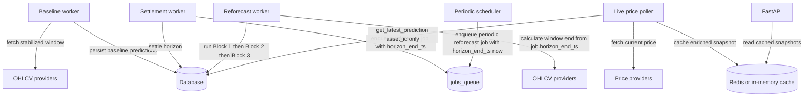

# Abacus Stack Review vs Investigation Findings (Baseline + Reforecast + Live Price) — Unified Diagnosis and Plan

Date: 2025-12-15  
Scope: Baseline worker, settlement worker, reforecast worker (periodic + settlement-triggered), providers (CCXT + Birdeye), prediction modules (Blocks 1–3), live price microservice (poller + API/cache).

References reviewed:
- [`docs/investigation/REFORECAST_OHLCV_ALIGNMENT_FINDINGS.md`](docs/investigation/REFORECAST_OHLCV_ALIGNMENT_FINDINGS.md:1)
- [`docs/investigation/PREDICTION_RANGE_ANALYSIS_STAKEHOLDER_REPORT.md`](docs/investigation/PREDICTION_RANGE_ANALYSIS_STAKEHOLDER_REPORT.md:1)
- [`docs/investigation/CROSS_FUNCTIONAL_PRESENTATION.md`](docs/investigation/CROSS_FUNCTIONAL_PRESENTATION.md:1)

---

## 1) Executive Summary (Critical Evaluation)

### What is validated as correct
- **Reforecasting uses fresh-enough OHLCV** in production for periodic jobs, and settlement-triggered staleness is on the order of the grace period + processing, not hours (as described in the findings).
- **The reforecast mechanism and horizon preservation are architecturally sound today**: reforecast updates predictions for existing immutable horizons, not recomputed timestamps (confirmed in the current worker implementation).

### What is validated as incorrect / misleading in the investigations
- The observed **-60 second offset** in “OHLCV window end” is **not evidence of hidden minute-flooring in the reforecast worker**.
  - It is explained by **provider candle timestamp semantics** and **end-exclusive filtering** in the CEX provider.

### What is the highest-impact product risk (likely contributor to stakeholder observation)
- The live price microservice poller selects **the most recently created prediction across any horizon** by calling `get_latest_prediction(asset_id=...)` without a `horizon_id` filter.
  - This makes the surface “active prediction” highly likely to be a Block 2/3 horizon (since periodic reforecast keeps those updated), producing the visible “multi-thousand-dollar swings” even if the user expected a nearer-term horizon.

### What is the highest-impact engineering correctness risk (independent of product selection)
- **Periodic CEX reforecasts can ingest partial current-minute candles** due to high-precision `end_time` and provider semantics.
  - This introduces avoidable noise and can amplify swings in an already sensitive exponential model.

### Root cause hierarchy (ordered by leverage)
1. **Product surface selection:** live price poller selects latest prediction across horizons (not an intended horizon).
2. **Algorithmic scaling/pathology:** Block 2 asymmetry + non-monotonic constants + exponential time scaling fed by 5×1m stats.
3. **Data integrity inconsistency:** baseline has stabilization; reforecast (especially periodic CEX) does not.

---

## 2) System Map (Observed Production Code Paths)

Notes:
- Reforecast horizons are sourced from `HorizonManager.get_unsettled_horizons(run_id, as_of)` using baseline `run_id` in [`abacus/ems/workers/reforecast_worker.py`](abacus/ems/workers/reforecast_worker.py:766).
- Live price API endpoints read only from cache in [`services/live_price_microservice/app/main.py`](services/live_price_microservice/app/main.py:326).

---

## 3) Findings Reconciled to Code (Deep Technical)

### 3.1 The -60s “window end” effect is provider semantics, not worker flooring
**Reforecast worker window calculation** is raw:
- [`ReforecastWorker.calculate_reforecast_window()`](abacus/ems/workers/reforecast_worker.py:474) uses:
  - `window_end = horizon_end_ts`
  - `window_start = horizon_end_ts - timedelta(minutes=N)`

**CEX provider defines end-exclusive behavior**:
- [`CCXTOhlcvProvider.fetch_ohlcv()`](abacus/ems/providers/ccxt_ohlcv_provider.py:70) filters candles with:
  - `item['unix_time'] < end_timestamp` in [`abacus/ems/providers/ccxt_ohlcv_provider.py`](abacus/ems/providers/ccxt_ohlcv_provider.py:139)

Because `unix_time` is the minute start, an end_time exactly at a minute boundary excludes that minute’s candle. That yields the consistent -60s effect observed for settlement-triggered jobs.

Conclusion: the findings’ observed behavior is real, but the location of the floor operation is misattributed; it is a consequence of data bucketing.

---

### 3.2 Stabilization and partial-candle handling is inconsistent across baseline vs reforecast (and across venues)

**Baseline**:
- Implements a stabilization buffer with explicit boundary semantics:
  - [`ScoringEngineService.calculate_last_5_minutes()`](abacus/ems/services/scoring_engine/main.py:261)
  - Uses `data_stabilization_buffer_minutes` (default 2)
  - Defines `[start_time, end_time)` semantics

**Reforecast DEX**:
- Uses a caller-side “drop last candle” approach:
  - Fetches N+1 and drops last candle in [`abacus/ems/workers/reforecast_worker.py`](abacus/ems/workers/reforecast_worker.py:623)
- Birdeye provider itself requests `[now-lookback, now]` and does not filter out a partial last candle:
  - [`BirdeyeOHLCVProvider._fetch_candles()`](abacus/ems/providers/birdeye_ohlcv_provider.py:220)

**Reforecast CEX**:
- Does not drop last candle in worker and relies on CCXT provider filtering.
- For **high-precision end_time** (periodic reforecast uses `now`), CCXT filtering can include the current minute’s candle start because `minute_start < now`.

Risk: periodic CEX reforecasts may ingest partial candles; this is avoidable and introduces noise that can be amplified by exponential formulas.

---

### 3.3 Algorithmic failures in Blocks 2 and 3 are confirmed by production code

#### Shared root: 5×1m log statistics drive long-horizon exponentials
Blocks compute `avg_log_change` and `std_log_change` from `ms2_1_results` logs derived from 5×1m inputs:
- Block 1: [`abacus/ems/modules/prediction/block1_outlook.py`](abacus/ems/modules/prediction/block1_outlook.py:61)
- Block 2: [`abacus/ems/modules/prediction/block2_continuation.py`](abacus/ems/modules/prediction/block2_continuation.py:87)
- Block 3: [`abacus/ems/modules/prediction/block3_persistency.py`](abacus/ems/modules/prediction/block3_persistency.py:76)

This architecture naturally produces unstable long-horizon outputs from small changes in inputs.

#### Block 2 asymmetry is real
- High range for periods 2–5 uses `avg * range_2hr + std * sqrt(range_12hr)`:
  - [`block2_continuation.py`](abacus/ems/modules/prediction/block2_continuation.py:249)
- Low range uses `avg * range_12hr - std * sqrt(range_2hr)`:
  - [`block2_continuation.py`](abacus/ems/modules/prediction/block2_continuation.py:267)

That asymmetry can narrow or distort bands in non-intuitive ways.

#### Non-monotonic constants are hardcoded
- Block 2: `RANGE_12HR_CONSTANTS = [28.8, 90, 180, 270, 151.2]`:
  - [`block2_continuation.py`](abacus/ems/modules/prediction/block2_continuation.py:42)
- Block 3: `RANGE_24HR_CONSTANTS = [57.6, 180, 360, 540, 302.4]`:
  - [`block3_persistency.py`](abacus/ems/modules/prediction/block3_persistency.py:33)

This supports the stakeholder report’s “bands narrowing” and “reset” behaviors.

#### hm_average semantics are arithmetic mean in code
Despite legacy phrasing, the code uses arithmetic mean:
- Block 1: `hm_average = mean([high, mid, low])`:
  - [`block1_outlook.py`](abacus/ems/modules/prediction/block1_outlook.py:232)
- Block 2: `(high + mid + low)/3`:
  - [`block2_continuation.py`](abacus/ems/modules/prediction/block2_continuation.py:343)
- Block 3: `(high + mid + low)/3`:
  - [`block3_persistency.py`](abacus/ems/modules/prediction/block3_persistency.py:240)

Action: align internal terminology and reporting to avoid misinterpretation.

---

### 3.4 Reforecast worker correctness: horizon preservation and block chaining
Reforecast worker:
- Retrieves unsettled horizons from baseline run using `as_of=job.horizon_end_ts`:
  - [`abacus/ems/workers/reforecast_worker.py`](abacus/ems/workers/reforecast_worker.py:766)
- Executes Block 1 then Block 2 then Block 3 and passes results forward:
  - [`abacus/ems/workers/reforecast_worker.py`](abacus/ems/workers/reforecast_worker.py:832)
  - [`abacus/ems/workers/reforecast_worker.py`](abacus/ems/workers/reforecast_worker.py:912)
  - [`abacus/ems/workers/reforecast_worker.py`](abacus/ems/workers/reforecast_worker.py:996)
- Persists predictions with original `horizon_metadata_id` and `horizon_end_ts`:
  - Example: [`abacus/ems/workers/reforecast_worker.py`](abacus/ems/workers/reforecast_worker.py:899)

This matches the intended design and supports the investigation’s conclusion that the reforecast mechanism itself is not the root cause of large deviations.

---

### 3.5 Live price microservice: ADR-015 fallback is correct, horizon selection is not explicit
#### Good: robust parsing and reforecast preference per horizon
- `get_latest_prediction()` supports `hm_average` and maps it to `hm_range`:
  - [`services/live_price_microservice/database.py`](services/live_price_microservice/database.py:304)
- Query prefers reforecast and falls back to baseline:
  - [`services/live_price_microservice/database.py`](services/live_price_microservice/database.py:233)

#### Problem: poller does not specify horizon_id, so it picks “latest prediction across any horizon”
- Poller calls `get_latest_prediction(asset_id=...)` without a horizon filter:
  - [`services/live_price_microservice/tasks/poller.py`](services/live_price_microservice/tasks/poller.py:183)
- FastAPI endpoints simply return cached snapshots:
  - [`services/live_price_microservice/app/main.py`](services/live_price_microservice/app/main.py:326)
  - No request-time horizon selector exists.

Effect: whatever horizon has the latest prediction write wins the “active” display. With periodic reforecast, this may systematically bias the displayed horizon toward Block 2/3.

---

## 4) Unified Diagnosis (Categorized)

### A) Data freshness (mostly OK)
- Periodic reforecast uses NOW; settlement-triggered reforecast uses horizon time; observed delays are consistent with grace and processing.
- The -60s effect is explained by provider semantics.

### B) Data integrity (actionable bug)
- CEX periodic reforecast can include partial current-minute candles.
- DEX reforecast has a workaround; baseline has centralized stabilization; reforecast lacks a unified stabilization policy.

### C) Algorithmic scaling and calibration (core root cause for large deviations and in-range failure)
- Exponential scaling with large time constants amplifies small log-change differences.
- Block 2 asymmetry and non-monotonic constants distort and narrow bands.
- 5×1m volatility source is too small for long horizons.

### D) Product surface and selection policy (likely contributor to stakeholder observation)
- Live price poller selects the most recent prediction across any horizon, which is not a stable or user-intuitive policy.
- FastAPI serves cached results; no horizon selection parameter is available.

---

## 5) Remediation Plan (Phased, No Time Estimates)

### Phase 0 — Observability to enable safe change
- Persist or log window metadata per prediction (window start/end, candle times, last_close used).
- Add explicit metadata to cached snapshots:
  - selected horizon metadata id
  - horizon end timestamp
  - block and horizon index
  - run type (baseline or reforecast)
  - prediction timestamp and age

### Phase 1 — Fix product-facing horizon selection (high ROI, low algorithm risk)
Decision required: what should “the” displayed horizon be?
- Option A: nearest unsettled horizon to now
- Option B: configured horizon per asset
- Option C: return multiple horizons in API and let clients choose

Implementation direction:
- Update poller selection to pass an explicit `horizon_id` to [`get_latest_prediction()`](services/live_price_microservice/database.py:204), or implement a new DB method to select horizon by time-to-settlement.
- Extend API to return either multiple horizons or include selection metadata.

### Phase 2 — Unify stabilization policy for reforecast inputs (integrity and consistency)
Goal: eliminate avoidable partial-candle noise and make CEX/DEX alignment consistent.

- Introduce a stabilized window end in reforecast worker for both CEX and DEX:
  - floor to minute
  - subtract buffer minutes
  - enforce end-exclusive semantics
- Remove asymmetry between CEX and DEX by enforcing identical last-candle completeness rules at a single layer.

### Phase 3 — Primary Proposal (Shadow Model): Block 1-style reforecast for ALL remaining horizons (solves telescope problem)
This is the recommended stakeholder-facing refactor because it directly addresses the core failure mode:
“a horizon that is 2 hours away should behave like a 2-hour prediction, regardless of whether it is labeled Block 3.”

Baseline remains unchanged:
- Baseline initializes the full 24h scope (Blocks 1/2/3) for all 15 horizons.

Reforecast changes:
- During reforecast, STOP re-running Block 2/3 “by identity”.
- For each remaining horizon, compute prediction using fresh OHLCV and a single consistent formula scaled by remaining time-to-settlement (now → horizon_end_ts).
- Roll out as a shadow output first (side-by-side evaluation), then promote to primary if it meets acceptance criteria.

Expected benefit:
- Eliminates “wrong telescope” scaling near settlement.
- Reduces reforecast redundancy (Block 2/3 become baseline-only or baseline-first).

### Phase 4 — Structural repair of existing Block 2/3 formulas (baseline correctness + consistency)
Even with a Block 1-style reforecast approach, the baseline and overall model family benefit from making Block 2/3 internally consistent:
- Remove Block 2 asymmetry (high/low time-scale mismatch).
- Make range constants monotonic and time-appropriate.
- Validate that Block 3 does not “reset narrower” than late Block 2 horizons.

### Phase 5 — Calibration knobs (NOT “artificial widening” if dispersion is mis-modeled)
If stakeholders need an explicit target for in-range coverage, treat range multipliers as calibration of dispersion, not as gaming the KPI.
This is justified only if dispersion is mis-modeled, which we have evidence for:
- Block 2 asymmetry and non-monotonic constants can structurally under/over-estimate range width.

Examples of calibration knobs (to be justified via backtest):
- Block-specific dispersion multipliers
- Realized-volatility-based dispersion (historical)
- Adaptive dispersion based on recent miss rate (guardrailed)

### Phase 6 — Documentation and stakeholder alignment
- Update internal documentation to reflect actual `hm_average` semantics and selection policy.
- Add a cross-functional “what users see” narrative tied to explicit selection rules.

---

## 6) Key Decisions Needed From Stakeholders
1. **What horizon should be displayed as the “active” prediction** in live price?
2. **What is the acceptable range width target** (per block) for in-range settlement rate?
3. **Should reforecast ranges converge as we approach settlement** (adaptive narrowing), or stay “structurally comparable” over the whole cycle?
4. **What is the canonical stabilization buffer for reforecast** (minutes) and should it differ between baseline and reforecast?

---

## 7) Recommended Next Steps
- Implement Phase 1 (horizon selection) and Phase 2 (stabilized window end) before algorithm changes; these reduce user confusion and stabilize inputs.
- Then proceed to Phase 3 algorithm updates with clear acceptance metrics:
  - in-range rates per block
  - distribution of range widths
  - hm_average absolute and percent errors near settlement
  - variance stability across reforecasts for Block 3 horizons
