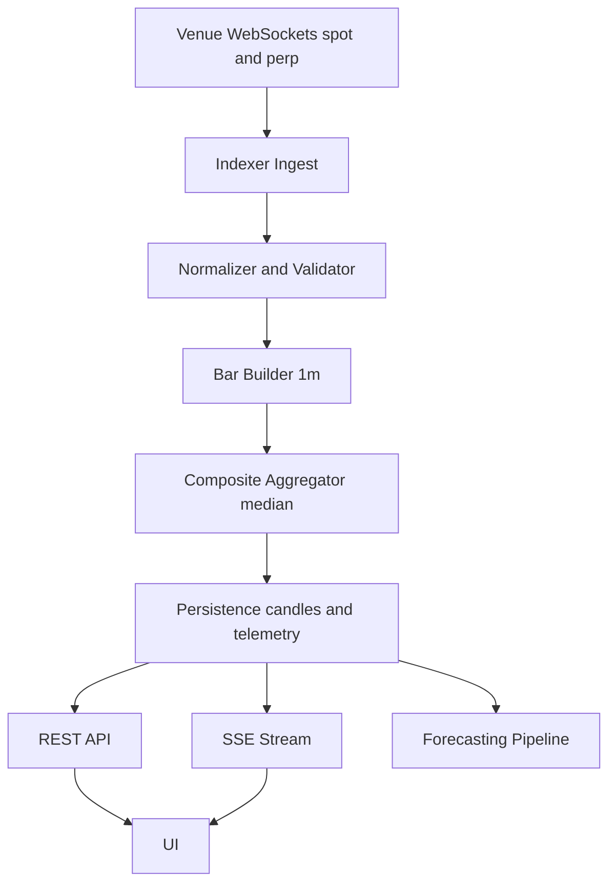

# ECS Handoff Package — Abacus Indexer v0

**Audience:** ECS / backend engineering team

**Purpose:** Single source of truth for building the always-on Abacus Indexer service (server-side), replacing browser WebSocket ingestion.

**Context:** Browser POC validates composite math + venue behavior, but does not scale (each user spawns multiple exchange WS connections). The indexer makes one canonical stream per asset/environment.

Primary references:

- Roadmap: [`plans/ABACUS_INDEX_PRODUCTION_ROADMAP.md`](plans/ABACUS_INDEX_PRODUCTION_ROADMAP.md:1)
- Soak spec + evidence contract: [`plans/ABACUS_INDEX_SOAK_REPORT_SPEC.md`](plans/ABACUS_INDEX_SOAK_REPORT_SPEC.md:1)
- Canonical types (use as API shape baseline): [`ciphex-predictions/src/features/abacus-index/types.ts`](ciphex-predictions/src/features/abacus-index/types.ts:1)
- Thresholds + phase config baseline: [`ciphex-predictions/src/features/abacus-index/constants.ts`](ciphex-predictions/src/features/abacus-index/constants.ts:1)
- Symbol mapping logic baseline: [`ciphex-predictions/src/features/abacus-index/symbolMapping.ts`](ciphex-predictions/src/features/abacus-index/symbolMapping.ts:1)
- Bar building/outlier logic baseline: [`ciphex-predictions/src/features/abacus-index/utils/barBuilder.ts`](ciphex-predictions/src/features/abacus-index/utils/barBuilder.ts:1), [`ciphex-predictions/src/features/abacus-index/utils/outlierFilter.ts`](ciphex-predictions/src/features/abacus-index/utils/outlierFilter.ts:1)

---

## 1) Deliverable overview

Build an ECS service that:

- Connects to constituent venues (spot required; perp optional) for BTC + ETH
- Computes and persists **canonical 1m bars** for:
  - Spot composite (required)
  - Perp composite (optional in v0)
- Exposes a versioned API for:
  - Backfill candles
  - Latest composite + forming candle
  - Telemetry/health
  - Optional gaps endpoint
- Streams real-time updates to the UI via SSE (preferred) or allows polling fallback

---

## 2) Indexer v0 scope freeze

### 2.1 Assets

- **BTC** and **ETH** only.

### 2.2 Canonical timeframe

- **1m bars are canonical**.
- Higher timeframes (5m/15m/1h/etc.) are derived server-side from 1m.
- Sub-minute bars (15s/10s) are out of scope for v0.

### 2.3 Market types

- Spot composite: **required**.
- Perp composite: **optional** (but recommended if stable in POC soak).
- Do **not** blend spot and perp into a single price series; compute both and derive features like basis.

### 2.4 Aggregation policy (v0)

- Composite price and composite bar close should use **median** across included venues.
- Exclude venues for:
  - disconnected
  - stale (per-venue stale thresholds)
  - outlier (median deviation > threshold)

### 2.5 Quorum policy (v0)

- v0 should enforce **min quorum = 2** for composite to be “connected”.
- “Preferred quorum” can remain higher (e.g., 3+) and drives a degraded state.

---

## 3) Module handoff matrix (port vs replace)

### 3.1 Reuse/port (logic)

Port these as server-side libraries (language can change, but logic should match):

- Types as contract baseline: [`ciphex-predictions/src/features/abacus-index/types.ts`](ciphex-predictions/src/features/abacus-index/types.ts:1)
- Venue → symbol mapping + parsing: [`ciphex-predictions/src/features/abacus-index/symbolMapping.ts`](ciphex-predictions/src/features/abacus-index/symbolMapping.ts:1)
- Trade → 1m bar logic, gap detection, align bars: [`barBuilder.ts`](ciphex-predictions/src/features/abacus-index/utils/barBuilder.ts:1)
- Outlier logic (median deviation + stale exclusion): [`outlierFilter.ts`](ciphex-predictions/src/features/abacus-index/utils/outlierFilter.ts:1)
- Threshold defaults (bps + stale thresholds): [`constants.ts`](ciphex-predictions/src/features/abacus-index/constants.ts:1)

### 3.2 Replace (POC-only)

- All browser WebSocket hooks under [`ciphex-predictions/src/features/abacus-index/hooks/venues/`](ciphex-predictions/src/features/abacus-index/hooks/venues/index.ts:1)
- Client-side composites under [`hooks/composites`](ciphex-predictions/src/features/abacus-index/hooks/composites/useSpotComposite.ts:1) and [`usePerpComposite`](ciphex-predictions/src/features/abacus-index/hooks/composites/usePerpComposite.ts:1) should become server-side aggregation jobs.
- UI debug harness is not part of ECS deliverable: [`AbacusIndexDebug`](ciphex-predictions/src/features/abacus-index/components/AbacusIndexDebug.tsx:47)

---

## 4) Invariants checklist (correctness rules)

These must survive the port.

### 4.1 Composite separation

- Maintain separate spot composite series and perp composite series.
- Basis is a derived feature, not part of either series.

### 4.2 Timestamp policy

- Use exchange-provided event timestamps for bar assignment where available.
- Receipt timestamps are telemetry only.

### 4.3 Stale handling

- Stale thresholds are per venue and per market type (see `STALE_THRESHOLDS_MS` in constants.ts).
- Stale exclusion occurs **before** outlier filtering — stale venues should not participate in median calculation at all.
- Order of exclusion: disconnected → stale → outlier.

### 4.4 Outlier handling

- Outliers are defined relative to the median.
- Outlier threshold is expressed in basis points.

### 4.5 Gap handling

- Track gap counts per venue.
- On disconnect, discard partial bar in progress.

### 4.6 Quorum and degraded semantics

- “Connected” means composite has at least min quorum.
- “Degraded” means connected but below preferred quorum or excluding a venue.

---

## 5) Proposed API contract v0 (draft)

This section is intentionally concrete; adjust naming, but preserve semantics.

### 5.1 REST — Backfill candles

`GET /v0/candles?asset=BTC&marketType=spot&timeframe=1m&start=...&end=...`

Response returns canonical 1m composite candles.

#### 5.1.1 Candle integrity policy (strict quorum + optional complete-coverage)

For forecasting stability, the default policy should be **composite-only, strict quorum**:

- A composite candle at minute `t` is computed only from venues that have a valid candle for `t`.
- If the number of included venues at `t` is below `minQuorum` (v0: 2), the composite candle is considered a **composite gap**.

To address your additional requirement (avoid the venue set changing inside a window), support an optional constraint:

- `requireCompleteCoverage=true` means: within the requested `[start,end]` window, **exclude an exchange from the entire response** if it is missing any minute in that window.

This makes the returned OHLCV comparable across all minutes but can reduce the number of venues contributing (more degraded / more gaps). It should be explicitly surfaced in response metadata.

Recommended query parameters:

- `qualityMode=strict` (default for forecasting)
- `minQuorum=2` (default)
- `preferredQuorum=3` (default)
- `requireCompleteCoverage=false|true` (default false)
- `includeMeta=true|false` (default true)

Response shape (TypeScript reference):

```typescript
{
  asset: 'BTC' | 'ETH';
  marketType: 'spot' | 'perp';
  timeframe: '1m';
  startMs: number;
  endMs: number;

  // Canonical composite bars in ascending time order.
  candles: CompositeBar[]; // see types.ts:145

  // Strongly recommended: explain data integrity decisions.
  meta?: {
    qualityMode: 'strict';
    minQuorum: number;
    preferredQuorum: number;
    requireCompleteCoverage: boolean;
    contributingVenues: string[];
    excludedVenues: Array<{ venue: string; reason: string }>;
    compositeGaps: Array<{ timeMs: number; reason: 'below_quorum' }>; // empty when fully covered
  };

  // Optional: allows cursor pagination if needed later.
  nextCursor?: string | null;
}
```

### 5.2 REST — Latest

`GET /v0/latest?asset=BTC`

Response shape (TypeScript reference):

```typescript
{
  asset: 'BTC' | 'ETH';
  timestamp: number;  // server time (ms)
  spot: {
    price: number | null;
    formingBar: CompositeBar | null;  // see types.ts:145
    lastCompletedBar: CompositeBar | null;
    degraded: boolean;
    degradedReason: DegradedReason;   // see types.ts:110
    includedVenues: string[];
    excludedVenues: Array<{ venue: string; reason: string }>;
    quorumUsed: number;
    minQuorum: number;
    preferredQuorum: number;
  };
  perp: {
    price: number | null;
    formingBar: CompositeBar | null;
    degraded: boolean;
    includedVenues: string[];
    excludedVenues: Array<{ venue: string; reason: string }>;
    quorumUsed: number;
    minQuorum: number;
    preferredQuorum: number;
  } | null;  // null if perp not enabled
  basisBps: number | null;  // perp - spot, in basis points
}
```

### 5.3 REST — Telemetry

`GET /v0/telemetry?asset=BTC`

Response shape (TypeScript reference):

```typescript
{
  asset: 'BTC' | 'ETH';
  timestamp: number;
  venues: Array<{
    venue: string;
    marketType: 'spot' | 'perp';
    connectionState: 'connected' | 'connecting' | 'disconnected' | 'error';
    lastMessageTime: number | null;
    messageCount: number;
    tradeCount: number;
    reconnectCount: number;
    gapCount: number;
    outlierExclusionCount: number;
    uptimePercent: number;
  }>;
  systemHealth: 'healthy' | 'degraded' | 'unhealthy';
}
```

### 5.4 SSE — Stream

`GET /v0/stream?asset=BTC`

Events:

- `price` (latest composite price) — cadence: 250-500ms
- `bar` (forming candle update) — on each trade batch
- `telemetry` (optional) — cadence: 5-10s

Each event should include a monotonic `sequence` number for client-side gap detection.

Event envelope (TypeScript reference):

```typescript
type StreamEvent = {
  sequence: number;
  timestamp: number; // server time (ms)
  asset: 'BTC' | 'ETH';
  type: 'price' | 'bar' | 'telemetry';
  payload: unknown;
};
```

**Reconnection contract:**
- On SSE reconnect, client should call `GET /v0/latest` first to resynchronize state
- Then resume streaming from `/v0/stream`

#### 5.4.1 Production integrity expectations

ECS indexer behavior should be deterministic under venue issues:

- If a venue WS disconnects or becomes stale, it is **excluded** from aggregation immediately (disconnected → stale → outlier).
- A single venue having a gap does **not** poison other venues.
- The composite for a minute is computed from the set of venues that have that minute (unless `requireCompleteCoverage=true` was requested for the entire window).
- If composite quorum falls below `minQuorum`, the system records a composite gap and marks degraded/unhealthy via telemetry.

Recommended operational behavior:

- On reconnect: resubscribe and resume; do not reuse old trade buffers.
- If the indexer detects missing minutes vs wall-clock, schedule REST backfill to repair gaps (mark repaired bars `is_backfilled=true` in persistence).

### 5.5 Error responses

All endpoints return errors in this shape:

```typescript
{
  error: string;   // human-readable message
  code: string;    // machine-readable code (e.g., "ASSET_NOT_FOUND", "RATE_LIMITED")
}
```

HTTP status codes: 400 (bad request), 404 (not found), 429 (rate limited), 500 (internal error)

---

## 6) Evidence attachments (required for v0 sign-off)

Attach:

- BTC soak JSON artifact produced by the UI harness (placeholder)
- ETH soak JSON artifact (placeholder)
- A short Go/No-go decision note tied to the criteria in [`plans/ABACUS_INDEX_SOAK_REPORT_SPEC.md`](plans/ABACUS_INDEX_SOAK_REPORT_SPEC.md:169)

---

## 7) Architecture sketch



---

## 8) Persistence considerations (ECS team discretion)

Storage schema is ECS team's choice. Recommendations:

- **Engine:** Time-series optimized (TimescaleDB, InfluxDB, or DynamoDB with time-based partitioning)
- **Retention:** Minimum 90 days for 1m bars; consider tiered retention (90d full resolution, 1y downsampled)
- **Backfill:** Historical data before indexer go-live can be sourced from exchange REST APIs (not in v0 scope, but plan for it)
- **Gap markers:** Persist `is_gap` and `is_backfilled` flags with each bar for audit trail

---

## 9) Forecasting consumer contract (v1 expectation)

In the v1 ECS production build, the forecasting tool should request **composite OHLCV** (not raw per-venue) and receive:

- A single canonical 1m candle series per `asset` + `marketType`
- Integrity metadata (quorum and excluded venues)

Recommended usage:

- Forecasting calls [`GET /v0/candles`](plans/ECS_HANDOFF_PACKAGE.md:131) with:
  - `qualityMode=strict`
  - `minQuorum=2`
  - optionally `requireCompleteCoverage=true` when you need a fixed venue set across the window

This yields an aggregate (median-based composite) OHLCV series. If the window cannot be satisfied without dropping below quorum, the response will either:

- include explicit `meta.compositeGaps[]` describing missing minutes, or
- return fewer candles (if the system chooses “omit gap minutes” rather than “emit null candle”) — but that behavior must be fixed and documented as part of the API contract.
