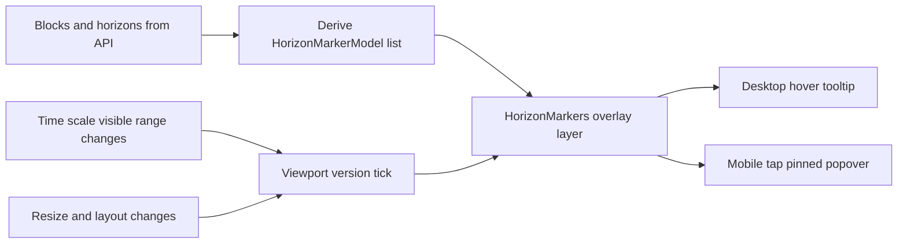

# Horizon X-Axis Markers — Repo Audit + UI/UX Recommendations

## Decision lock (per product direction)
- **Show markers for ALL horizons that fall within the visible time range**.
- **Desktop**: hover shows tooltip.
- **Mobile**: tap opens a **pinned popover anchored to the marker**.

Implementation note: a Popover primitive is not currently present in this repo; `@radix-ui/react-popover` is not in dependencies in [`package.json`](ciphex-predictions/package.json:11). You can either add it (recommended) or implement a lightweight pinned-card overlay.

## 1) What the repo does today (relevant behavior)

### Data model for horizons/blocks
- Horizons are `pending` or `settled`, carry `direction`, `signal`, `probability`, and optionally settlement fields `variance_pct` + `in_range`.
  - See [`Horizon`](ciphex-predictions/src/types/predictions.ts:1).
- Predictions are grouped into blocks with a label and an array of horizons.
  - See [`Block`](ciphex-predictions/src/types/predictions.ts:15).

### Where prediction data comes from
- UI calls [`usePredictions()`](ciphex-predictions/src/hooks/usePredictions.ts:21) which fetches [`/api/predictions/[assetId]`](ciphex-predictions/src/app/api/predictions/[assetId]/route.ts:8).
- The server route calls [`fetchPredictions()`](ciphex-predictions/src/lib/api/ciphex.ts:104) and transforms the Ciphex dashboard payload via [`transformDashboardResponse()`](ciphex-predictions/src/lib/api/ciphex.ts:26).
  - Timestamps are set to `horizon_end_ts` (converted to unix seconds) in [`transformDashboardResponse()`](ciphex-predictions/src/lib/api/ciphex.ts:49).
- `usePredictions` clears old predictions *before paint* on asset switch using an isomorphic layout effect pattern.
  - See clearing logic in [`useIsomorphicLayoutEffect()`](ciphex-predictions/src/hooks/usePredictions.ts:64).

### How the chart is rendered
- The chart uses `lightweight-charts` in a custom component [`PriceChart`](ciphex-predictions/src/components/chart/PriceChart.tsx:207).
- Prediction bands are drawn as 3 colored block area-series + a dashed mid line, with Catmull-Rom interpolation that snaps points to the active candle interval.
  - Interpolation entry point: [`interpolatePredictions()`](ciphex-predictions/src/components/chart/PriceChart.tsx:1169).
- The chart already uses DOM overlays in the chart container (example: crosshair band values are rendered as absolutely-positioned y-axis labels).
  - See the overlay labels block: [`Prediction band Y-axis labels on crosshair hover`](ciphex-predictions/src/components/chart/PriceChart.tsx:1671).

### Existing time-scale subscription pattern
- The component already subscribes to visible logical range changes for time-scale sync between main pane and MACD pane.
  - Subscription: [`subscribeVisibleLogicalRangeChange()`](ciphex-predictions/src/components/chart/PriceChart.tsx:728).
  - This is directly reusable as a trigger to recompute x-coordinates for any x-axis overlay.

### Existing marker usage
- The chart uses built-in series markers only for *block start markers* (a small square with text), applied via [`setMarkers()`](ciphex-predictions/src/components/chart/PriceChart.tsx:1310).
  - These markers render in the plot area, not on the x-axis label row.

### Tooltip implementation
- The app uses Radix Tooltip wrapped by a local UI component.
  - Root wrapper: [`Tooltip()`](ciphex-predictions/src/components/ui/tooltip.tsx:21).
  - Content: [`TooltipContent()`](ciphex-predictions/src/components/ui/tooltip.tsx:37).
  - Note: current [`Tooltip()`](ciphex-predictions/src/components/ui/tooltip.tsx:21) creates a new [`TooltipProvider()`](ciphex-predictions/src/components/ui/tooltip.tsx:8) instance per tooltip.

## 2) Review of the dev team plan (what’s strong vs what’s missing)

### What’s strong (plan alignment with repo)
1) **DOM overlay approach is consistent with existing patterns**
   - The chart already uses DOM overlays for y-axis labels (absolute-positioned labels over the canvas) in [`PriceChart`](ciphex-predictions/src/components/chart/PriceChart.tsx:1671).
2) **Non-destructive to chart rendering**
   - No need to write custom canvas renderers or fork `lightweight-charts`.
3) **Leverages existing tooltip stack**
   - Tooltips already exist and have a coherent dark theme usage in the sidebar, e.g. [`HorizonsList`](ciphex-predictions/src/components/sidebar/HorizonsList.tsx:67).

### Key gaps / risks to address
1) **Coordinate validity for future times**
   - `timeScale.timeToCoordinate(time)` can return `null` if the time is not present on the chart’s internal time scale.
   - In this repo, prediction series data (interpolated) likely introduces future timestamps on the active grid, which helps, but the overlay should still:
     - snap marker times to the same grid logic as [`interpolatePredictions()`](ciphex-predictions/src/components/chart/PriceChart.tsx:1176), and
     - treat `null`/out-of-bounds coordinates as “not renderable”.

2) **Resize + layout changes won’t always emit visible-range events**
   - The chart already has a `ResizeObserver` that resizes the chart canvas (see resize applyOptions around [`ResizeObserver`](ciphex-predictions/src/components/chart/PriceChart.tsx:605)).
   - Your marker-position recomputation must also run on resize and on MACD divider drags (height changes) even if visible logical range doesn’t change.

3) **Tooltip-provider-per-marker overhead**
   - Rendering ~50 markers each using [`Tooltip()`](ciphex-predictions/src/components/ui/tooltip.tsx:21) means 50 providers.
   - It’s probably acceptable for ~50, but the plan’s “many horizons” case plus hover effects can create measurable overhead. A mitigation is to wrap the whole marker layer once with [`TooltipProvider()`](ciphex-predictions/src/components/ui/tooltip.tsx:8) and use the Radix Root/Trigger/Content primitives, or refactor the local Tooltip wrapper.

4) **Mobile interaction model**
   - Radix tooltips are hover-oriented. On touch, users expect tap-to-open behavior.
   - Financial apps typically use:
     - tooltip on pointer devices,
     - **tap-to-pin popover** on touch (anchored to the datum).

5) **Chart panning gesture conflicts**
   - Any pointer-enabled DOM overlay can “steal” pan/drag events from the chart.
   - Mitigation: keep markers small, and only treat a small clickable hitbox as interactive.

## 3) UI/UX recommendation (modern financial platform patterns)

### Visual language
Triangular markers are workable, but the more modern, platform-consistent approach is:
- **Small circular/dot markers** (8–10px) with a subtle ring (1px border) + block color fill.
- Optional state styling:
  - `pending`: gentle pulse (respecting reduced-motion)
  - `settled`: solid, slightly lower opacity
- Avoid stacking triangles (visual noise). If multiple horizons fall very close in time, use:
  - horizontal jitter of 2–3px, or
  - “cluster” marker with `+N` badge in tooltip.

### Interaction
- Hover/tap reveals a compact card:
  - Block label (Outlook/Continuation/Persistence)
  - Time (local)
  - Target (mid), High, Low
  - Direction + Signal + Probability
  - If settled: variance + in-range indicator (reusing `ACCURACY_COLORS` in [`formatters.ts`](ciphex-predictions/src/lib/utils/formatters.ts:48))

### Optional but high-ROI enhancements (Bloomberg/TV feel)
- On hover, draw a subtle vertical guideline at the marker time (DOM overlay div at x-coordinate).
- On click, center the chart to that timestamp via `timeScale.setVisibleRange` or `scrollToPosition` (if you adopt that API).

## 4) Technical recommendation (best-fit implementation for this repo)

### Keep the DOM overlay approach, but adjust how positions are computed
Instead of maintaining a full `Map<timestamp,x>` state that updates on every pan/zoom:
- Compute **only visible markers**, and compute coordinates **on demand** using `timeScale.timeToCoordinate`.
- Maintain a lightweight “viewport version” state that increments when:
  - visible logical range changes (reuse [`subscribeVisibleLogicalRangeChange()`](ciphex-predictions/src/components/chart/PriceChart.tsx:728))
  - container resizes (hook into the existing resize path)

This reduces state churn and avoids a `Map` that can go stale.

### Snap marker times consistently
Use the same interval-snapping rule used by band interpolation (see grid snap inside [`interpolatePredictions()`](ciphex-predictions/src/components/chart/PriceChart.tsx:1179)):
- `snappedTime = floor(time / intervalSeconds) * intervalSeconds`

### Mobile: use Popover instead of Tooltip (recommended)
- Desktop pointer: Radix Tooltip is fine.
- Touch: prefer a Popover with **controlled open state** to support “tap to pin” without fighting hover-out semantics.

If you add Radix Popover, mirror the local tooltip wrapper in [`tooltip.tsx`](ciphex-predictions/src/components/ui/tooltip.tsx:1) and the select popper styling in [`select.tsx`](ciphex-predictions/src/components/ui/select.tsx:62).

### Where to integrate
- Keep the marker layer inside the “Main price chart pane” wrapper (the `relative` div) so it sits above the chart and above the x-axis label row.
  - See pane wrapper in [`PriceChart` return JSX](ciphex-predictions/src/components/chart/PriceChart.tsx:1661).

## 5) Adjusted implementation plan (recommended)

### Step A — Define UX contract (inputs/outputs)
- Define `HorizonMarkerModel` built from existing [`Horizon`](ciphex-predictions/src/types/predictions.ts:1) + block index + derived fields.

Recommended model fields:
- `id`: stable key (e.g. `${blockIndex}:${horizonIndex}`)
- `time`: original horizon time (unix seconds)
- `timeSnapped`: snapped to the chart grid (match logic in [`interpolatePredictions()`](ciphex-predictions/src/components/chart/PriceChart.tsx:1169))
- `blockIndex`, `blockLabel`
- `status`, `direction`, `signal`, `probability`
- `high`, `close`, `low`
- optional settlement: `variance_pct`, `in_range`

### Step B — Shared constants
- Avoid importing non-exported internals from [`PriceChart`](ciphex-predictions/src/components/chart/PriceChart.tsx:207).
- Move colors (or a subset) into a shared module so [`HorizonMarkers`](ciphex-predictions/src/components/chart/PriceChart.tsx:207) and future components can reuse them.

### Step C — Marker overlay component
- New: `HorizonMarkers.tsx` renders a single absolutely-positioned layer.
- It receives:
  - `markers: HorizonMarkerModel[]`
  - access to chart timeScale + container width
  - `intervalSeconds` for snapping

### Step D — Viewport update triggers
- Subscribe to visible logical range change (existing pattern) + resize.
- Recompute positions using `requestAnimationFrame` batching.

### Step E — Performance & accessibility
- Filter to visible range + cap at N visible.
- Implement keyboard focus and `aria-label`.
- Respect reduced motion for pulse.

## 6) What I would change in the dev team plan

1) Replace `markerPositions: Map<timestamp,x>` with “viewportVersion + derived coordinates”
   - Less state, fewer reconciliation updates, harder to get stale.

2) Add explicit resize-driven recompute
   - Visible-range subscription alone is not enough.

3) Don’t default to Tooltip on mobile
   - Choose Popover or tap-to-pin tooltip behavior.

4) Use dot/diamond markers instead of triangles
   - More modern and less visually aggressive.

## 7) Acceptance checklist (aligned to your verification list, plus missing items)
- Coordinates remain correct on:
  - pan/zoom ([`subscribeVisibleLogicalRangeChange()`](ciphex-predictions/src/components/chart/PriceChart.tsx:728))
  - resize (existing resize observer path)
  - interval switch (chart resets handled by [`chartContextKey`](ciphex-predictions/src/components/chart/PriceChart.tsx:207))
- No stale overlay paint after asset switch (mirror the clear-before-paint pattern in [`usePredictions`](ciphex-predictions/src/hooks/usePredictions.ts:64)).
- Mobile tap opens details reliably.
- Marker layer does not block chart pan/zoom except on direct marker interaction.

## 8) Suggested architecture diagram

